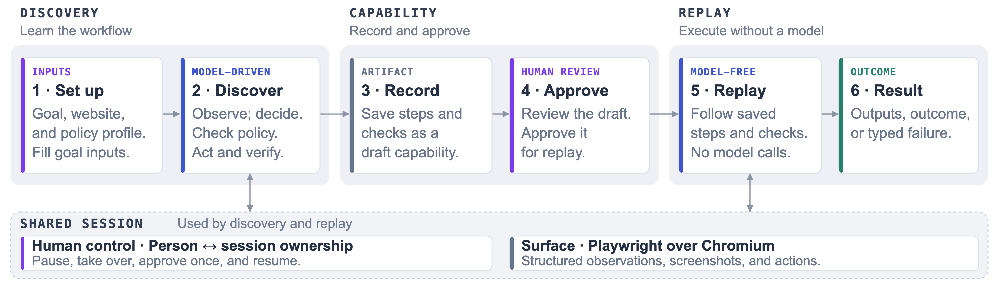

# Design Report

## Architecture

  
   
  <a href="docs/assets/architecture.svg">Diagram source (SVG)</a>

I implemented the system as a Python package with separate components for LLM-driven discovery, capability recording/review, and deterministic replay. Discovery and replay share the same policy and `Surface` abstractions, while `Control` manages ownership of the live session so automation can pause, hand control to a human, and resume on the same session. The current `BrowserSurface` uses Playwright with Chromium.

The surface supports both structured and visual observation. Structured observations expose roles, accessible names, DOM attributes, frame context, and surrounding controls. Screenshots with local PP-OCRv4 OCR provide an alternative for interfaces where useful structure is unavailable, including the canvas test surface. This keeps discovery from depending on a clean DOM while preserving a common interface for observation and input.

Discovery uses GPT-6 Luna through the Responses API with `xhigh` reasoning effort. The model proposes one typed operation per turn, but the executor enforces permissions, resolves the target against the current page, performs the action, and verifies its result. Runs are bounded by step and time limits, and page content is treated as untrusted application data. This keeps authorization and execution controls outside the LLM.

After a successful run, the recorder converts the verified interaction into a draft capability. Optional comparison against a second member helps distinguish reusable UI structure from record-specific data, and separate discovery can capture expected branches such as `record_not_found`. The draft must be reviewed and approved before replay, which then executes the recorded capability without further LLM decisions.

## Artifact schema

I represent each reusable workflow as a typed, versioned JSON capability validated by `capability.py`. The artifact defines the application and entry conditions, discovery provenance and review state, typed inputs and outputs, reusable targets, execution restrictions and limits, and a graph of actions and verification checks. I used a graph rather than a flat action list so the capability can represent expected business outcomes, recovery paths, and human intervention while still defining the conditions required for successful completion. This makes the artifact a reviewable execution contract rather than a saved model transcript.

Invocation-specific data is stored as references rather than retaining discovery values. Actions reference typed inputs such as `member_id` instead of storing the value used during discovery. Values extracted during execution, such as `membership_status` or `account_number`, are returned through the artifact's declared outputs. Structural targets use reusable roles, names, attributes, frame context, and record scopes; visual targets use OCR text anchors with relative offsets or approved image templates. Targets must resolve unambiguously, and the recorder refuses to save checks or targets it cannot represent safely. Secret values are never stored in the capability; only declared secret references are retained for runtime resolution.

## Determinism & error handling

Replay validates the capability, policy compatibility, invocation inputs, and expected entry state before execution. It then follows the saved capability graph without model decisions, re-resolving each target against the current screen, checking preconditions, and verifying the resulting state before following a recorded transition. It returns expected business outcomes, such as `record_not_found`, as outcomes rather than failures. Recoverable conditions use bounded waiting and retries, while unresolved or unsafe states stop or request human intervention instead of guessing.

Mutating actions are handled more conservatively because retrying an action with an uncertain result could duplicate a change. After dispatch, replay looks for positive evidence that the action completed and never resends an uncertain mutation. If it cannot establish the result, it returns `delivery_uncertain` and requests help. Outputs are returned only after the capability's completion checks pass, and unsuccessful runs include a structured status, reason, failing node, attempts, and diagnostic evidence.

The collected evidence covers both normal and exceptional paths across the responsive, component, and canvas interfaces. Lookup capabilities successfully replayed known results and learned `record_not_found` outcomes. Slow-response cases recovered through bounded waiting, while some failed-load, server-error, and expired-session cases escalated but timed out awaiting intervention. A lost-reply write test issued a single commit and stopped with `delivery_uncertain` rather than risking a duplicate write. The component write flow completed discovery, capability export, and replay successfully, although its returned account number was not independently validated against the database. The canvas write replay made the correct database change but returned the account number with incorrect letter casing, so that result is not treated as fully correct.

## Heterogeneity & multi-tenant

The `Surface` abstraction separates how an application is observed and controlled from the discovery and replay logic. The current `BrowserSurface` supports conventional web pages, open shadow DOM, and canvas-based interfaces through structured or visual observation. A desktop implementation could provide the same `Surface` operations using accessibility APIs, screenshots, and native input, keeping the higher-level discovery and replay flow unchanged. Desktop execution is not implemented, and browser-specific application identity such as origins and routes would need an equivalent representation for other surfaces. The responsive application is the primary end-to-end target; the component and canvas applications are additional validation surfaces used to exercise the same abstractions with open shadow DOM and visual-only interaction rather than separate implementations.

For multi-tenant reuse, I would keep the capability graph, input/output contract, and verification checks shared for institutions using the same vendor application, while storing tenant-specific configuration separately for differences such as origin, routes, or approved UI labels. The system still validates each tenant configuration against its own policy and entry conditions before replay. If those checks no longer match the application, the system stops replay for review or rediscovery rather than applying another tenant's assumptions. Cross-tenant capability reuse is a proposed extension; the current implementation uses separate profiles and capabilities.

## Escalation & handoff

The system raises an intervention when automation cannot safely continue, including risky actions that require approval, uncertain write delivery, missing information during discovery, or repeated failures to make progress. Each request includes the run context, current step, reason, and proposed action when relevant. `Control` tracks ownership of the live session and prevents automated input while a person is using the browser. `Resume` returns the same session to automation without granting approval, while `Approve once` authorizes only the current proposed action after fresh policy, target, and record checks. Commands are tied to the current run and intervention, so a stale approval cannot authorize a later action.

Manual actions performed during a handoff are recorded without persisting entered values. Human-required steps remain explicit in the saved capability and request intervention again during replay, continuing only after the recorded condition is verified. The handoff evidence exercises pause, manual control, approval, rejection, and resume in the same browser session.

## Safety

A configurable policy profile defines which origins, routes, action types, and observation modes the system may use. The profile remains fixed during a run: the model can request additional restrictions or approval, but it cannot permit itself or override a policy denial. Data-changing submissions are treated as risky and require fresh approval, while record-bound actions must provide evidence that they apply to the intended record. The demo also blocks administrative routes and downloads.

Sensitive values are kept out of reusable artifacts and saved evidence. Secrets are referenced by environment-variable name rather than stored directly, and fields containing secrets are protected from structured reads and masked in screenshots. Invocation values remain typed references, while website text is saved only after it has been confirmed as reusable interface text; known private values override that confirmation. Logs and journals retain structural metadata and placeholders rather than entered values or raw screenshots.

These safeguards intentionally favor stopping or escalating when the system cannot establish permission, record identity, or data safety. Their main limitation is that they depend on what the application surface exposes, so incomplete structure or OCR errors can also cause valid actions to be rejected.

## Cuts

The white-label responsive application is the primary end-to-end stand-in for the assignment. It uses synthetic banking data but exercises real UI interactions, account lookup and creation, database changes, exceptional outcomes, deterministic replay, and human handoff. I also tested the same system against component and canvas applications to validate that the core abstractions did not depend on a conventional DOM. These additional surfaces are validation targets rather than separate implementations; the component application exercises open shadow DOM, while the canvas application requires visual observation and OCR.

I intentionally kept the operator interface minimal and did not implement desktop execution, remote co-browsing, cross-tenant infrastructure, a capability catalog, or model-assisted recovery during replay. The `Surface` boundary, policy/profile separation, and capability representation provide seams for these extensions, but I did not implement them. This kept the work focused on the assignment's core path: LLM-driven discovery, capability recording and review, deterministic replay, safety, and same-session intervention.

Current limitations mainly involve conservative recording rules and visual recognition. The recorder refuses to export checks containing invocation-specific data that it cannot safely parameterize. This fail-closed behavior prevents reusable capabilities from retaining private or unstable discovery data, but it can also reject otherwise valid workflows. The canvas write made the correct database change, but OCR returned the account number with incorrect letter casing. I would first make check parameterization and recording less brittle without weakening the privacy guarantees, then improve deterministic visual recognition and output normalization.
